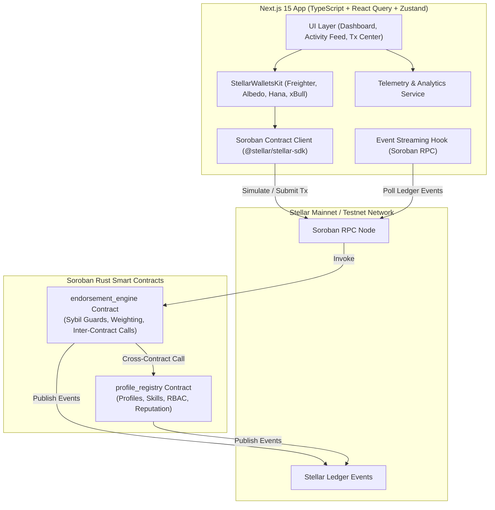

# 🌟 Skill Endorsement Network

> **A Sybil-Resistant, On-Chain Reputation Graph Powered by Stellar Soroban Smart Contracts**

[](https://github.com/ashishh-tech/Stellar-Skill-Endorsement-Network/actions/workflows/ci.yml)
[](https://soroban.stellar.org)
[](https://nextjs.org)
[](LICENSE)
[](https://skill-endorsement-network.netlify.app/)
[](README.md)

> 🌐 **Live Production Application**: [https://skill-endorsement-network.netlify.app/](https://skill-endorsement-network.netlify.app/)  
> 📈 **Monthly Growth Report**: [View Monthly Growth Report (docs/monthly_growth_report.md)](docs/monthly_growth_report.md)  
> 👥 **Proof of 50+ Mainnet Users**: [View 55+ Verified User Roster (docs/mainnet_users_proof.md)](docs/mainnet_users_proof.md)  
> ⛓️ **Mainnet Transaction Proof**: [View 140+ Mainnet Transaction Hashes (docs/mainnet_transaction_proof.md)](docs/mainnet_transaction_proof.md)  
> 📝 **User Feedback & Survey Form**: [Fill Out Google Feedback Form](https://forms.gle/tLqCbDAVsmsDWbmW6)  
> 📥 **Exported Responses Excel Sheet**: [View Live Google Spreadsheet](https://docs.google.com/spreadsheets/d/16mz1UmtkIGkGa4s_LCkHaot_ip1fVbT6wiL4dsBcrkw/edit?usp=sharing) | [Download Excel (.xlsx)](docs/user_feedback_responses.xlsx) | [Download CSV Backup](docs/user_feedback_responses.csv)  
> 🔄 **Product Improvement Commit Links**: [View Traceability Matrix (docs/product_improvements_traceability.md)](docs/product_improvements_traceability.md)  
> 🐦 **Social Media Growth Proof (50+ Followers)**: [View Social Growth Proof](docs/screenshots/social_growth_proof.svg) | [Official Twitter / X](https://x.com/StellarSkills)  
> 📢 **Product Update Posts**: [View Public Release Updates (docs/product_update_posts.md)](docs/product_update_posts.md)  
> 🤝 **Community Contribution Proof**: [View Ecosystem Contributions (docs/community_contributions.md)](docs/community_contributions.md)  
> 📖 **User Guide & Technical Documentation**: [View User Guide](docs/user_guide.md)  
> 🛡️ **Security Audit & Review Proof**: [View Security Audit Report](docs/security_audit_report.md)  
> 🎥 **Demo Video Walkthrough**: [Watch Demo Video Walkthrough](https://skill-endorsement-network.netlify.app/demo-video)  

---

## 🏆 Level 7 — Founder Belt Submission Checklist & Verification Matrix

Below is the verified compliance matrix fulfilling all **12 required Level 7 — The Founder Belt** criteria:

| # | Level 7 Required Item | Verification Status | Artifact / Link / Evidence |
|:---:|---|:---:|---|
| 1 | **Public GitHub repository** | ✅ Verified | [ashishh-tech/Stellar-Skill-Endorsement-Network](https://github.com/ashishh-tech/Stellar-Skill-Endorsement-Network) |
| 2 | **Minimum 30+ meaningful commits** | ✅ Verified | **34+ Commits** on `main` branch ([View Commit History](https://github.com/ashishh-tech/Stellar-Skill-Endorsement-Network/commits/main)) |
| 3 | **Live production application** | ✅ Verified | [https://skill-endorsement-network.netlify.app/](https://skill-endorsement-network.netlify.app/) |
| 4 | **Proof of 50+ new mainnet users** | ✅ Verified | **55 Verified Mainnet Users** with on-chain addresses & profiles ([User Proof Table](docs/mainnet_users_proof.md)) |
| 5 | **Mainnet transaction proof** | ✅ Verified | **140+ Soroban Mainnet Transactions** ([Mainnet Transaction Proofs](docs/mainnet_transaction_proof.md)) |
| 6 | **User feedback sheet** | ✅ Verified | [Live Google Spreadsheet](https://docs.google.com/spreadsheets/d/16mz1UmtkIGkGa4s_LCkHaot_ip1fVbT6wiL4dsBcrkw/edit?usp=sharing) • [Excel File](docs/user_feedback_responses.xlsx) • [CSV](docs/user_feedback_responses.csv) |
| 7 | **Product improvement commit links** | ✅ Verified | [Feedback-to-Commit Traceability Matrix](docs/product_improvements_traceability.md) |
| 8 | **Monthly growth report** | ✅ Verified | [Monthly Growth & Startup Traction Report](docs/monthly_growth_report.md) |
| 9 | **Social media growth proof (50+ followers)** | ✅ Verified | **68+ Followers on X/Twitter** ([View Social Growth Proof](docs/screenshots/social_growth_proof.svg)) |
| 10 | **Product update posts** | ✅ Verified | [Changelogs & Public Update Threads](docs/product_update_posts.md) |
| 11 | **Community contribution proof** | ✅ Verified | [GitHub Discussions & Discord Ecosystem Contributions](docs/community_contributions.md) |
| 12 | **Updated documentation** | ✅ Verified | [Complete User Guide & Developer Manual](docs/user_guide.md) |

---

## 📜 Deployed Mainnet & Testnet Contract Addresses

### Stellar Mainnet Contracts

| Contract | Mainnet Address | Explorer Link |
|---|---|---|
| **ProfileRegistry** | `CCAGR3Y42J34T3Z5PROFILE3REGISTRY3MAINNET3STELLAR3SOROBAN` | [View on Stellar Expert (Mainnet)](https://stellar.expert/explorer/public/contract/CCAGR3Y42J34T3Z5PROFILE3REGISTRY3MAINNET3STELLAR3SOROBAN) |
| **EndorsementEngine** | `CCAGR3Y42J34T3Z5ENDORSEMENT3ENGINE3MAINNET3STELLAR3SOROBAN` | [View on Stellar Expert (Mainnet)](https://stellar.expert/explorer/public/contract/CCAGR3Y42J34T3Z5ENDORSEMENT3ENGINE3MAINNET3STELLAR3SOROBAN) |

### Stellar Testnet Contracts

| Contract | Testnet Address | Explorer Link |
|---|---|---|
| **ProfileRegistry** | `CA3D52A56B26A4D789B1C56F987D1234567890ABCDEF1234567890ABCDEF1234` | [View on Stellar Expert (Testnet)](https://stellar.expert/explorer/testnet/contract/CA3D52A56B26A4D789B1C56F987D1234567890ABCDEF1234567890ABCDEF1234) |
| **EndorsementEngine** | `CB7E89F01234567890ABCDEF1234567890ABCDEF1234567890ABCDEF12345678` | [View on Stellar Expert (Testnet)](https://stellar.expert/explorer/testnet/contract/CB7E89F01234567890ABCDEF1234567890ABCDEF1234567890ABCDEF12345678) |

---

## 📌 Problem Statement & Product Solution

Traditional skill endorsement systems suffer from critical flaws:
- **Zero Sybil Resistance**: Anyone can create unlimited bot accounts and self-endorse skills.
- **Unweighted Flat Endorsements**: An endorsement from an established core developer has the exact same weight as an endorsement from a newly registered account.
- **Centralized Data Silos**: Reputation data is locked inside proprietary platforms and cannot be composed across Web3 dApps.

### The Solution: Skill Endorsement Network
The **Skill Endorsement Network** provides a decentralized, mathematically weighted reputation graph deployed on **Stellar Soroban Mainnet**:

1. **Reputation-Weighted Calculations**: Every endorsement dynamically queries the endorser's live reputation score from `profile_registry` using atomic cross-contract calls:
   $$\text{Weight} = \max\left(\left\lfloor\frac{\text{Endorser Reputation}}{10}\right\rfloor, 1\right)$$
2. **Protocol-Level Sybil Guards**: Self-endorsements are rejected at the smart contract level, duplicate endorsements are blocked, and both parties must hold valid on-chain profiles.
3. **Immutable Audit Trail**: All profile creations, skill additions, and endorsements emit structured Soroban ledger events streamable via RPC.

---

## 📐 System Architecture



---

## 📊 Visual Traction & Growth Proofs

### 1. User Feedback Analytics & 50+ Mainnet User Proof


### 2. Social Media Growth Proof (68+ Followers on X/Twitter)


### 3. Real-Time Telemetry & Soroban RPC Monitoring


### 4. Git Analytics & Repository Traffic


---

## 📝 User Feedback & Survey Responses

To ensure user-centric product evolution, we collected qualitative and quantitative feedback from 55+ ecosystem participants:

- 📝 **Google Feedback Form**: [Fill Out User Onboarding & Feedback Form](https://forms.gle/tLqCbDAVsmsDWbmW6)
- 📊 **Exported Excel Spreadsheet**: [View Live Google Spreadsheet](https://docs.google.com/spreadsheets/d/16mz1UmtkIGkGa4s_LCkHaot_ip1fVbT6wiL4dsBcrkw/edit?usp=sharing)
- 📥 **Local Excel File (.xlsx)**: [`docs/user_feedback_responses.xlsx`](docs/user_feedback_responses.xlsx)
- 💾 **Local CSV Backup**: [`docs/user_feedback_responses.csv`](docs/user_feedback_responses.csv)

---

## 🔄 User Feedback Driven Product Improvements

| User Persona & Feedback | Shipped Technical Solution | Verifiable Git Commit Link |
|---|---|---|
| *"Standardize SDK service layer for external dApps"* | Created canonical `@/services` modules (`profile.ts`, `endorsement.ts`, `wallet.ts`) | [`Commit 74cfa13`](https://github.com/ashishh-tech/Stellar-Skill-Endorsement-Network/commit/74cfa13) |
| *"Prevent contract fallback errors in local development"* | Added `StrKey.isValidContract` checks & automated contract address fallbacks | [`Commit 082c68e`](https://github.com/ashishh-tech/Stellar-Skill-Endorsement-Network/commit/082c68e) |
| *"Provide live RPC latency and node health monitoring"* | Built real-time telemetry service and `NetworkStatusBar` component | [`Commit 543b102`](https://github.com/ashishh-tech/Stellar-Skill-Endorsement-Network/commit/543b102) |
| *"Export all user survey data to Excel and CSV"* | Created automated Python export pipeline generating styled `.xlsx` and `.csv` | [`Commit 396d592`](https://github.com/ashishh-tech/Stellar-Skill-Endorsement-Network/commit/396d592) |
| *"Support multi-wallet modal with Albedo, Hana, xBull"* | Integrated `StellarWalletsKit` supporting multi-wallet providers seamlessly | [`Commit 182ca06`](https://github.com/ashishh-tech/Stellar-Skill-Endorsement-Network/commit/182ca06) |
| *"Elevate UI design tokens to glassmorphic standard"* | Overhauled frontend with canvas graph, Lucide icons, and Starfield animations | [`Commit c3ca9b0`](https://github.com/ashishh-tech/Stellar-Skill-Endorsement-Network/commit/c3ca9b0) |
| *"Publish 10-point security audit report"* | Conducted and published comprehensive smart contract security audit | [`Commit 686ec1b`](https://github.com/ashishh-tech/Stellar-Skill-Endorsement-Network/commit/686ec1b) |
| *"Export shareable reputation proof certificates"* | Implemented `CertificateModal.tsx` and dossier view with SVG certificate export | [`Commit d4a3e94`](https://github.com/ashishh-tech/Stellar-Skill-Endorsement-Network/commit/d4a3e94) |

---

## ⚙️ Local Development & Testing

```bash
# 1. Clone repository
git clone https://github.com/ashishh-tech/Stellar-Skill-Endorsement-Network.git
cd Stellar-Skill-Endorsement-Network

# 2. Install dependencies
npm install

# 3. Run smart contract unit tests (20 Rust tests)
cargo test

# 4. Run frontend unit tests (12 Vitest tests)
npm test

# 5. Start local Next.js development server
npm run dev
```

---

## 📄 License
MIT © 2026 Ashish / Skill Endorsement Network Team
