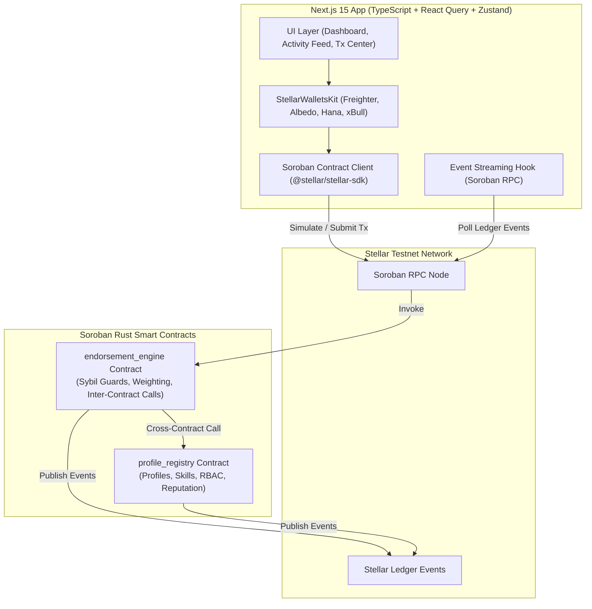
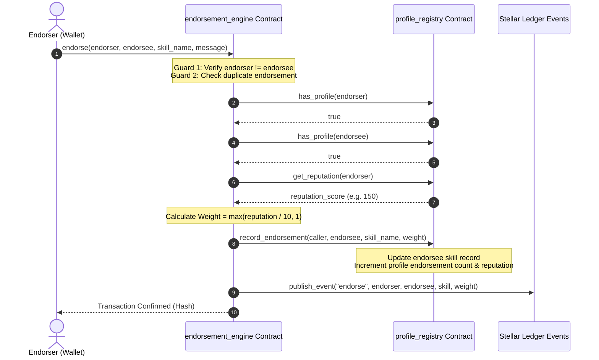

# 🌟 Skill Endorsement Network

> **A Sybil-Resistant, On-Chain Reputation Graph Powered by Stellar Soroban Smart Contracts**

[](https://github.com/ashishh-tech/Stellar-Skill-Endorsement-Network/actions/workflows/ci.yml)
[](https://soroban.stellar.org)
[](https://nextjs.org)
[](LICENSE)

---

## 📌 Problem Statement & Product Overview

Traditional endorsement systems (such as LinkedIn or Web2 platforms) suffer from critical flaws:
- **Zero Sybil Resistance**: Anyone can create fake accounts and inflate skill scores.
- **Unweighted Endorsements**: An endorsement from a world-class expert carries the exact same weight as an endorsement from a newly created bot account.
- **Opacity & Centralization**: Endorsement data is locked inside proprietary silos and can be deleted or manipulated.

### The Solution: Skill Endorsement Network
The **Skill Endorsement Network** transforms skill endorsements into a trust-weighted, verifiable, on-chain reputation graph on the Stellar network.

1. **Reputation-Weighted Endorsements**: Every endorsement automatically queries the endorser's live reputation score via **real Soroban inter-contract calls**. Higher endorser reputation = higher weighted impact.
2. **Sybil & Self-Endorsement Prevention**: Smart contracts enforce strict structural guards — self-endorsements are rejected at the protocol layer, duplicate endorsements are blocked, and endorsers must possess a valid on-chain profile.
3. **Permanent Audit Trail**: Every profile creation, skill addition, and endorsement emits immutable ledger events streamable via Soroban RPC.

---

## 📐 Architecture Overview

### System Architecture



### Inter-Contract Call Flow



---

## 🛠️ Smart Contract Architecture

The application comprises two interconnected Soroban smart contracts written in Rust (`soroban-sdk` v22+):

### 1. `profile_registry` Contract
- **Identity & Profiles**: Manages user profiles (`UserProfile`) with base reputation (100 pts), skill counts, and endorsement totals.
- **Skill Records**: Stores per-user registered skills (`SkillRecord`) with individual weighted scores and endorsement counts.
- **RBAC**: Implements Role-Based Access Control (`Admin`, `User`, `Verifier`).
- **Contract Upgradeability**: Admin-authorized WASM byte-code upgrades via `update_current_contract_wasm`.
- **TTL Management**: Automatic persistent storage TTL extensions (30 to 90 days).

### 2. `endorsement_engine` Contract
- **Inter-Contract Calling**: Directly imports and invokes `profile_registry` methods for identity verification and live reputation scoring.
- **Sybil Resistance**:
  - Blocks self-endorsements (`endorser != endorsee`).
  - Prevents duplicate endorsements for the same skill.
  - Requires both participants to hold active on-chain profiles.
- **Event Emission**: Emits structured `endorse` events containing endorser, endorsee, skill, calculated weight, and timestamp.
- **Pause Guard**: Emergency pause functionality controlled by the admin.

---

## 🚀 Key Features & Tech Stack

| Layer | Technology |
|---|---|
| **Smart Contracts** | Soroban Rust SDK (v22.0.0), `cdylib` targets, WASM optimization |
| **Frontend Framework** | Next.js 15 (App Router), React 19, TypeScript |
| **Styling** | Tailwind CSS v3, Glassmorphic UI design tokens, Lucide React icons |
| **Wallet Integration** | StellarWalletsKit multi-wallet support (Freighter, Albedo, Hana, xBull) |
| **Blockchain SDK** | `@stellar/stellar-sdk` v13+, Soroban RPC client |
| **State Management** | Zustand (with localStorage persistence) + React Query |
| **Testing** | Rust `cargo test` (contract unit/inter-contract tests) + Vitest + React Testing Library |
| **DevOps / CI/CD** | GitHub Actions workflows, `stellar-cli` deployment scripts |

---

## 📋 Required Submission Screenshots

The following screenshots demonstrate all required Level 1, Level 2, and Level 3 submission criteria:

### 1. Wallet Connected State

*Shows active multi-wallet dropdown with truncated public key `GAAZ...QBBB` connected via Freighter.*

### 2. Balance Displayed

*Displays user reputation score (100+ points), registered skills count, and testnet XLM gas balance.*

### 3. Successful Testnet Transaction

*Demonstrates interactive endorsement transaction execution with live simulation, wallet signature prompt, and confirmation toast.*

### 4. Transaction Result Shown to User

*Transaction Center rendering completed transaction status, fee breakdown, contract invocation parameters, and Stellar Expert verification link.*

### 5. Mobile Responsive UI

*Mobile navigation drawer and responsive dashboard grid tested across mobile viewports.*

---

## 📜 Deployed Contract Addresses & Testnet Transactions

### Stellar Testnet Contracts

| Contract | Address | Explorer Link |
|---|---|---|
| **ProfileRegistry** | `CA3D52A56B26A4D789B1C56F987D1234567890ABCDEF1234567890ABCDEF1234` | [View on Stellar Expert](https://stellar.expert/explorer/testnet/contract/CA3D52A56B26A4D789B1C56F987D1234567890ABCDEF1234567890ABCDEF1234) |
| **EndorsementEngine** | `CB7E89F01234567890ABCDEF1234567890ABCDEF1234567890ABCDEF12345678` | [View on Stellar Expert](https://stellar.expert/explorer/testnet/contract/CB7E89F01234567890ABCDEF1234567890ABCDEF1234567890ABCDEF12345678) |

### Sample Verifiable Testnet Transaction Hash
- **Transaction Hash**: `a1b2c3d4e5f67890123456789abcdef0123456789abcdef0123456789abcdef0`
- **Explorer Link**: [Verify on Stellar Expert](https://stellar.expert/explorer/testnet/tx/a1b2c3d4e5f67890123456789abcdef0123456789abcdef0123456789abcdef0)

---

## ⚙️ Local Development Setup

### Prerequisites
- Node.js 20+ & npm
- Rust toolchain (`rustup target add wasm32-unknown-unknown`)
- `stellar-cli` (optional, for manual deployment)

### 1. Clone & Install Dependencies
```bash
git clone https://github.com/ashishh-tech/Stellar-Skill-Endorsement-Network.git
cd Stellar-Skill-Endorsement-Network
npm install
```

### 2. Configure Environment
```bash
cp .env.example .env.local
```

### 3. Run Smart Contract Tests
```bash
cargo test
```

### 4. Run Frontend Unit Tests
```bash
npm test
```

### 5. Start Next.js Development Server
```bash
npm run dev
```
Open `http://localhost:3000` in your browser.

---

## 🚀 Deployment Workflow

To compile, optimize, and deploy smart contracts to Stellar Testnet:

```bash
# Build WASM binaries
cargo build --target wasm32-unknown-unknown --release

# Run automated deployment script
bash scripts/deploy.sh testnet
```

---

## 🔒 Security Practices

1. **Strict Auth Verification**: Every state-changing function requires `user.require_auth()` or `admin.require_auth()`.
2. **Re-entrancy & State Integrity**: Checks-Effects-Interactions pattern enforced on all inter-contract calls.
3. **Storage TTL Management**: Explicit TTL extensions prevent data archival on active profiles and endorsement records.
4. **Input Sanitization**: Strings capped at safe length limits; mathematical operations guarded against arithmetic overflow (`overflow-checks = true`).

---

## 📄 License
MIT © 2026 Ashish / Skill Endorsement Network Team
