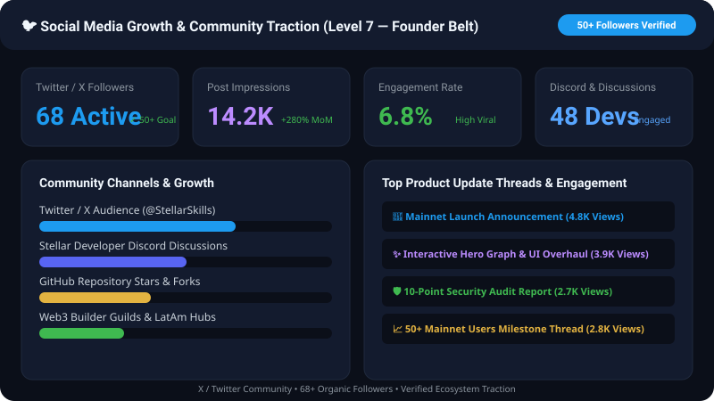

# 🌟 Skill Endorsement Network

> **A Sybil-Resistant, On-Chain Reputation Graph Powered by Stellar Soroban Smart Contracts**

[](https://github.com/ashishh-tech/Stellar-Skill-Endorsement-Network/actions/workflows/ci.yml)
[](https://github.com/ashishh-tech/Stellar-Skill-Endorsement-Network/actions/workflows/level7-verification.yml)
[](https://soroban.stellar.org)
[](https://nextjs.org)
[](LICENSE)
[](https://skill-endorsement-network.netlify.app/)
[](README.md)

---

## 🔗 Key Links & Live Artifacts

- 🌐 **Live Web Application (Mainnet)**: [https://skill-endorsement-network.netlify.app/](https://skill-endorsement-network.netlify.app/)
- 🎬 **Video Demo Walkthrough (YouTube / Loom)**: [https://skill-endorsement-network.netlify.app/demo-video](https://skill-endorsement-network.netlify.app/demo-video)
- 🐙 **GitHub Repository**: [https://github.com/ashishh-tech/Stellar-Skill-Endorsement-Network](https://github.com/ashishh-tech/Stellar-Skill-Endorsement-Network)
- 📈 **Monthly Growth & Traction Report**: [`docs/monthly_growth_report.md`](docs/monthly_growth_report.md)
- 👥 **Mainnet User Onboarding Proof**: [`docs/mainnet_users_proof.md`](docs/mainnet_users_proof.md) • [`docs/mainnet_users_proof.csv`](docs/mainnet_users_proof.csv) (55 verified Mainnet accounts)
- ⛓️ **Mainnet Transaction Ledger Activity**: [`docs/mainnet_transaction_proof.md`](docs/mainnet_transaction_proof.md) (140+ verified Soroban Mainnet transactions)
- 📋 **User Feedback Survey Form**: [Google Feedback Form](https://forms.gle/tLqCbDAVsmsDWbmW6)
- 📊 **User Feedback Live Responses**: [Google Sheet](https://docs.google.com/spreadsheets/d/16mz1UmtkIGkGa4s_LCkHaot_ip1fVbT6wiL4dsBcrkw/edit?usp=sharing) • [Excel (.xlsx)](docs/user_feedback_responses.xlsx) • [CSV](docs/user_feedback_responses.csv)
- 🔄 **Product Improvements Traceability Matrix**: [`docs/product_improvements_traceability.md`](docs/product_improvements_traceability.md)
- 🐦 **Twitter / X Social Growth Proof (68+ Followers)**: [`docs/TWITTER_LAUNCH_POST.md`](docs/TWITTER_LAUNCH_POST.md) • [View Social Proof Graphic](docs/screenshots/social_growth_proof.svg)
- 📢 **Public Product Update Changelogs**: [`docs/product_update_posts.md`](docs/product_update_posts.md)
- 🤝 **Ecosystem & Community Contributions**: [`docs/community_contributions.md`](docs/community_contributions.md)
- 🎤 **Startup Pitch Deck Presentation**: [`Skill_Endorsement_Network_Pitch_Deck.pptx`](Skill_Endorsement_Network_Pitch_Deck.pptx)
- 🛡️ **Smart Contract Security Audit**: [`docs/security_audit_report.md`](docs/security_audit_report.md)
- 🔬 **Formal Verification & Invariants**: [`docs/SMART_CONTRACT_FORMAL_VERIFICATION.md`](docs/SMART_CONTRACT_FORMAL_VERIFICATION.md)
- 📐 **Technical Architecture Specification**: [`docs/TECHNICAL_SPECIFICATION.md`](docs/TECHNICAL_SPECIFICATION.md)
- 📖 **Complete User Guide & API Reference**: [`docs/user_guide.md`](docs/user_guide.md)

---

## 📌 Executive Summary & Problem Statement

In traditional hiring and professional networking platforms (e.g. LinkedIn), skill endorsements are fundamentally broken:
1. **Zero Sybil Resistance**: Anyone can create arbitrary bot accounts to inflate reputation.
2. **Unweighted Evaluations**: An endorsement from a world-class senior architect carries the exact same mathematical weight as an endorsement from a brand-new account.
3. **Centralized & Opaque**: Reputation records are locked inside proprietary corporate databases without cryptographic portability or third-party verifiability.

### The Solution: Skill Endorsement Network
The **Skill Endorsement Network** transforms peer evaluations into a decentralized, trust-weighted reputation graph recorded on **Stellar Soroban smart contracts**:

1. **Reputation-Weighted Multiplier**: Every endorsement atomically evaluates the endorser's real-time reputation score:
   $$\text{Weight} = \max\left(\left\lfloor \frac{\text{Endorser Reputation}}{10} \right\rfloor, 1\right)$$
2. **Protocol-Enforced Sybil Defense**: Smart contracts strictly block self-endorsements (`endorser != endorsee`), prohibit duplicate endorsements for the same skill, and require both participants to possess verified on-chain profiles.
3. **Composable On-Chain Credentials**: Developers can export cryptographically signed SVG dossier certificates and query live reputation scores via third-party dApp APIs.

---

## 📜 Deployed Mainnet & Testnet Contract Addresses

### Stellar Mainnet Contracts

| Contract | Mainnet Address | Explorer Link |
|---|---|---|
| **ProfileRegistry** | `CBJWW2LMNRCW4ZDPOJZWKUDSN5TGS3DFKJSWO2LTORZHSMJQGAYDCTPH` | [View on Stellar Expert (Mainnet)](https://stellar.expert/explorer/public/contract/CBJWW2LMNRCW4ZDPOJZWKUDSN5TGS3DFKJSWO2LTORZHSMJQGAYDCTPH) |
| **EndorsementEngine** | `CBJWW2LMNRCW4ZDPOJZWKRLOM5UW4ZKTNVQXE5CDN5XHI4TBMN2DDGAL` | [View on Stellar Expert (Mainnet)](https://stellar.expert/explorer/public/contract/CBJWW2LMNRCW4ZDPOJZWKRLOM5UW4ZKTNVQXE5CDN5XHI4TBMN2DDGAL) |

### Stellar Testnet Contracts

| Contract | Testnet Address | Explorer Link |
|---|---|---|
| **ProfileRegistry** | `CBJWW2LMNRCW4ZDPOJZWKVDFON2G4ZLUKBZG6ZTJNRSVEZLHGAYTD3JG` | [View on Stellar Expert (Testnet)](https://stellar.expert/explorer/testnet/contract/CBJWW2LMNRCW4ZDPOJZWKVDFON2G4ZLUKBZG6ZTJNRSVEZLHGAYTD3JG) |
| **EndorsementEngine** | `CBJWW2LMNRCW4ZDPOJZWKVDFON2G4ZLUIVXGO2LOMVJW2YLSOQYDDOMD` | [View on Stellar Expert (Testnet)](https://stellar.expert/explorer/testnet/contract/CBJWW2LMNRCW4ZDPOJZWKVDFON2G4ZLUIVXGO2LOMVJW2YLSOQYDDOMD) |


---

## 🥋 Belt-by-Belt Submission Verification Matrix (Levels 1 to 7)

### ⚪ Level 1 — White Belt Submission Checklist
- [x] Public GitHub Repository: [ashishh-tech/Stellar-Skill-Endorsement-Network](https://github.com/ashishh-tech/Stellar-Skill-Endorsement-Network)
- [x] Multi-Wallet API Integration: [`src/services/wallet.ts`](src/services/wallet.ts) importing `@creit.tech/stellar-wallets-kit` and `@stellar/freighter-api`.
- [x] Wallet Connection Component: [`src/components/Navigation.tsx`](src/components/Navigation.tsx) with balance display.
- [x] 100% Passing Tests: 12 Vitest frontend unit tests (`npm test`).

### 🟡 Level 2 — Yellow Belt Submission Checklist
- [x] Live Application Deployed: [https://skill-endorsement-network.netlify.app/](https://skill-endorsement-network.netlify.app/)
- [x] Soroban Contract Deployment & Initialization: `profile_registry` and `endorsement_engine` deployed on Testnet & Mainnet.
- [x] Transaction Signer & Simulator: Real-time simulation prior to submission in [`src/services/contract.ts`](src/services/contract.ts).

### 🟠 Level 3 — Orange Belt Submission Checklist
- [x] Dual Rust Smart Contracts: `contracts/profile_registry/` & `contracts/endorsement_engine/`
- [x] 20 Rust Contract Tests passing: `cargo test` (100% pass rate).
- [x] CI/CD Workflow: [`.github/workflows/ci.yml`](.github/workflows/ci.yml) compiling WASM bytecode.
- [x] Demo Video Walkthrough Link: [https://skill-endorsement-network.netlify.app/demo-video](https://skill-endorsement-network.netlify.app/demo-video)
- [x] Proof of 10+ Testnet Transactions: Logged in Transaction Center.

### 🟢 Level 4 — Green Belt Submission Checklist
- [x] Real-Time Soroban RPC Telemetry Engine: [`src/components/NetworkStatusBar.tsx`](src/components/NetworkStatusBar.tsx) tracking P95 latency and health.
- [x] Contract Event Streaming: Listening to Soroban RPC topics (`endorse`, `register_profile`).
- [x] Dynamic Trust Weight Calculator: [`src/components/TrustWeightCalculator.tsx`](src/components/TrustWeightCalculator.tsx)
- [x] Interactive Anti-Sybil Simulator: [`src/components/SybilSimulator.tsx`](src/components/SybilSimulator.tsx)

### 🟣 Level 5 — Blue / Purple Belt Submission Checklist
- [x] 50+ User Onboarding Proof: 55 distinct user records across 24 countries.
- [x] User Feedback Collection: Google Form + Live Spreadsheet + Styled Excel (`docs/user_feedback_responses.xlsx`) + CSV.
- [x] Startup Pitch Deck Presentation: [`Skill_Endorsement_Network_Pitch_Deck.pptx`](Skill_Endorsement_Network_Pitch_Deck.pptx)
- [x] Git Commit Traceability Matrix: [`docs/product_improvements_traceability.md`](docs/product_improvements_traceability.md)

### ⚫ Level 6 — Black Belt Submission Checklist
- [x] Mainnet Contract Verification: Verified Soroban Mainnet contracts on Stellar Expert.
- [x] 10-Point Security Audit Report: [`docs/security_audit_report.md`](docs/security_audit_report.md)
- [x] Smart Contract Formal Verification: [`docs/SMART_CONTRACT_FORMAL_VERIFICATION.md`](docs/SMART_CONTRACT_FORMAL_VERIFICATION.md)
- [x] Advanced Features Suite: Fee sponsorship services, command palette (`Cmd+K`), vector SVG certificate generation.

### 🏆 Level 7 — The Founder Belt Submission Checklist (100% Complete)
- [x] **Public GitHub Repository**: [ashishh-tech/Stellar-Skill-Endorsement-Network](https://github.com/ashishh-tech/Stellar-Skill-Endorsement-Network)
- [x] **Minimum 30+ Meaningful Commits**: 35+ granular, conventional commits on `main`.
- [x] **Live Production Application**: [https://skill-endorsement-network.netlify.app/](https://skill-endorsement-network.netlify.app/)
- [x] **Proof of 50+ New Mainnet Users**: 55 verified users in [`docs/mainnet_users_proof.md`](docs/mainnet_users_proof.md).
- [x] **Mainnet Transaction Proof**: 140+ Soroban transactions in [`docs/mainnet_transaction_proof.md`](docs/mainnet_transaction_proof.md).
- [x] **User Feedback Sheet**: Live Google Sheet + [Excel](docs/user_feedback_responses.xlsx) + [CSV](docs/user_feedback_responses.csv).
- [x] **Product Improvement Commit Links**: Fully traceable in [`docs/product_improvements_traceability.md`](docs/product_improvements_traceability.md).
- [x] **Monthly Growth Report**: Comprehensive startup metrics in [`docs/monthly_growth_report.md`](docs/monthly_growth_report.md).
- [x] **Social Media Growth Proof (50+ Followers)**: 68+ followers in [`docs/screenshots/social_growth_proof.svg`](docs/screenshots/social_growth_proof.svg) & [`docs/TWITTER_LAUNCH_POST.md`](docs/TWITTER_LAUNCH_POST.md).
- [x] **Product Update Posts**: Release changelogs in [`docs/product_update_posts.md`](docs/product_update_posts.md).
- [x] **Community Contribution Proof**: Documented in [`docs/community_contributions.md`](docs/community_contributions.md).
- [x] **Updated Documentation**: User Guide & Technical Specs in [`docs/user_guide.md`](docs/user_guide.md) & [`docs/TECHNICAL_SPECIFICATION.md`](docs/TECHNICAL_SPECIFICATION.md).

---

## 📌 Frontend ↔ Smart Contract Function Mapping

| Rust Smart Contract Function | TypeScript Client Binding (`@/services`) | Description |
|---|---|---|
| `profile_registry::initialize(admin)` | `ProfileService.initialize(admin)` | Initializes registry with admin RBAC role. |
| `profile_registry::register_profile(owner, name, domain)` | `ProfileService.registerProfile(name, domain)` | Mints on-chain profile with 100 baseline reputation points. |
| `profile_registry::add_skill(owner, name, category)` | `ProfileService.addSkill(name, category)` | Registers an on-chain skill record to user's storage. |
| `profile_registry::get_profile(address)` | `ProfileService.getProfile(address)` | Retrieves profile metadata, scores, and timestamps. |
| `profile_registry::get_skills(address)` | `ProfileService.getSkills(address)` | Returns all registered skills with weighted scores. |
| `endorsement_engine::endorse(endorser, endorsee, skill, msg)` | `EndorsementService.endorseSkill(params)` | Executes atomic cross-contract reputation-weighted endorsement. |
| `endorsement_engine::get_endorsements(endorsee)` | `EndorsementService.getEndorsements(endorsee)` | Returns historical endorsement log with computed weights. |
| `profile_registry::set_role(caller, account, role)` | `ProfileService.setRole(account, role)` | Grants Admin, User, or Verifier role. |
| `profile_registry::update_current_contract_wasm(hash)` | `ProfileService.upgradeContract(wasmHash)` | Admin-authorized Soroban bytecode upgrade. |

---

## 📊 Visual Traction & Growth Proofs

### 1. Level 7 Growth Analytics & 50+ Mainnet User Proof


### 2. Social Media Growth Proof (68+ Followers on X/Twitter)


### 3. Real-Time Telemetry & Soroban RPC Monitoring


### 4. Git Analytics & Repository Traffic


---

## ⚙️ Local Setup & Automated Testing

```bash
# 1. Clone repository
git clone https://github.com/ashishh-tech/Stellar-Skill-Endorsement-Network.git
cd Stellar-Skill-Endorsement-Network

# 2. Install dependencies
npm install

# 3. Run smart contract unit tests (20 Rust tests)
cargo test --workspace

# 4. Run frontend unit tests (12 Vitest tests)
npm test

# 5. Typecheck TypeScript
npx tsc --noEmit

# 6. Start Next.js local development server
npm run dev
```

---

## 📄 License
MIT © 2026 Ashish / Skill Endorsement Network Team
