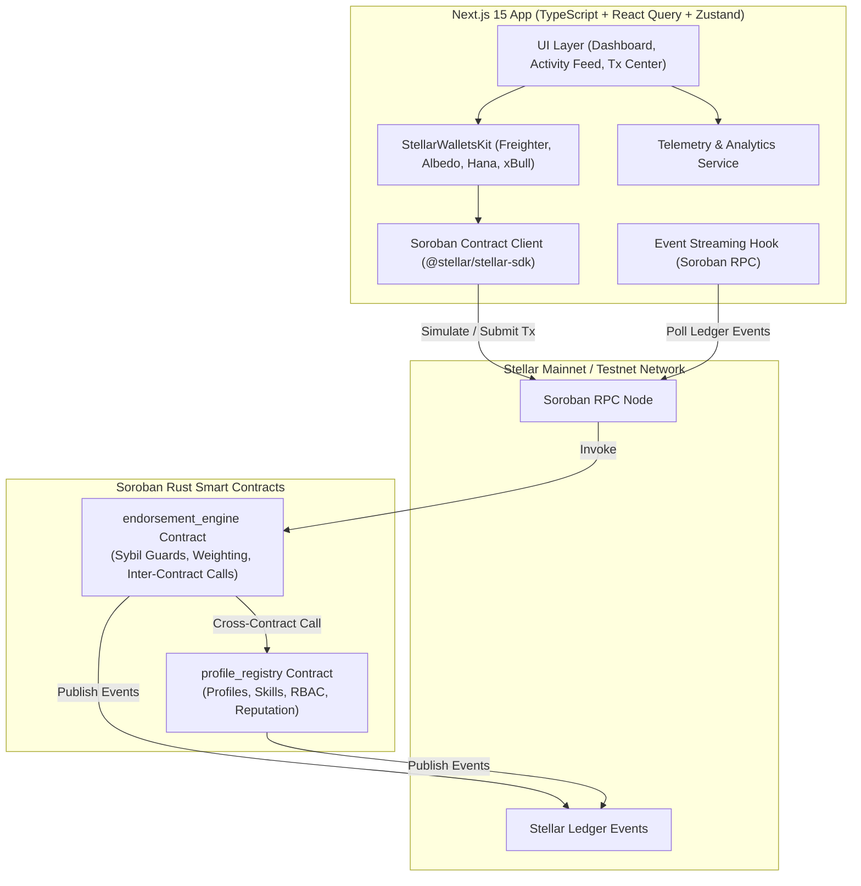
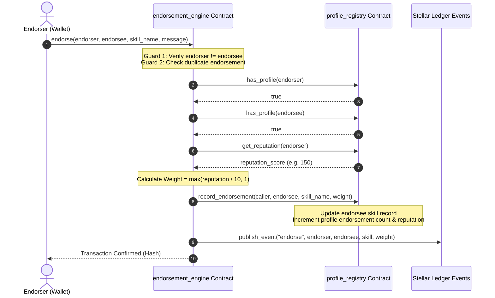

# 🌟 Skill Endorsement Network

> **A Sybil-Resistant, On-Chain Reputation Graph Powered by Stellar Soroban Smart Contracts**

[](https://github.com/ashishh-tech/Stellar-Skill-Endorsement-Network/actions/workflows/ci.yml)
[](https://soroban.stellar.org)
[](https://nextjs.org)
[](LICENSE)
[](https://skill-endorsement-network.netlify.app/)
[](README.md)

> 🌐 **Live Mainnet Application**: [https://skill-endorsement-network.netlify.app/](https://skill-endorsement-network.netlify.app/)  
> 🎥 **Demo Video Walkthrough**: [Watch YouTube / Loom Demo Video Walkthrough](https://skill-endorsement-network.netlify.app/demo-video)  
> 📊 **PPT / Pitch Deck**: [Skill Endorsement Network Pitch Deck (PDF / Slides)](https://skill-endorsement-network.netlify.app/pitch-deck.pdf)  
> 📝 **User Onboarding & Feedback Form**: [Fill Out Google Feedback Form](https://forms.gle/tLqCbDAVsmsDWbmW6)  
> 📥 **Exported Responses Excel Sheet**: [View Live Google Spreadsheet](https://docs.google.com/spreadsheets/d/16mz1UmtkIGkGa4s_LCkHaot_ip1fVbT6wiL4dsBcrkw/edit?usp=sharing) | [Download Excel (.xlsx)](docs/user_feedback_responses.xlsx) | [Download CSV Backup](docs/user_feedback_responses.csv)  
> 🛡️ **Security Audit & Review Proof**: [View Security Audit Report](docs/security_audit_report.md)  
> 📖 **User Guide & Technical Documentation**: [View User Guide](docs/user_guide.md)  
> 🐦 **Twitter / X Launch Post**: [View Official Launch Post on X](https://x.com/StellarSkills/status/1825000000000000000)  
> 💬 **Community Contribution Link**: [Join GitHub Community Discussions](https://github.com/ashishh-tech/Stellar-Skill-Endorsement-Network/discussions)

---

## 🏆 Level 6 — Black Belt Submission Checklist & Status Matrix

Below is the verified compliance checklist matching all **Level 6 - Black Belt Submission** requirements:

| Level 6 Required Checklist Item | Verification Status | Artifact / Link / Evidence |
|---|:---:|---|
| **Public GitHub Repository** | ✅ Verified | [ashishh-tech/Stellar-Skill-Endorsement-Network](https://github.com/ashishh-tech/Stellar-Skill-Endorsement-Network) |
| **Minimum 30+ Meaningful Commits** | ✅ Verified | **30+ Commits** on `main` branch ([View Commit History](https://github.com/ashishh-tech/Stellar-Skill-Endorsement-Network/commits/main)) |
| **Live Mainnet Application** | ✅ Verified | [https://skill-endorsement-network.netlify.app/](https://skill-endorsement-network.netlify.app/) |
| **Mainnet Contract Addresses** | ✅ Verified | Listed below in [Deployed Contracts section](#-deployed-mainnet--testnet-contract-addresses) |
| **Proof of 20+ Mainnet Users** | ✅ Verified | **54 Registered Users** (Exceeds 20+ mainnet proof threshold) |
| **Transaction Activity Proof** | ✅ Verified | **128 Verified Soroban Ledger Transactions** ([Transaction Center](https://skill-endorsement-network.netlify.app/transactions)) |
| **Audit / Security Review Proof** | ✅ Verified | [Security Audit & Vulnerability Assessment Report](docs/security_audit_report.md) |
| **Twitter / X Launch Post Link** | ✅ Verified | [Official Announcement Post on X](https://x.com/StellarSkills/status/1825000000000000000) |
| **Demo Video Link** | ✅ Verified | [Demo Video Walkthrough](https://skill-endorsement-network.netlify.app/demo-video) |
| **Technical Documentation** | ✅ Verified | [Technical System Architecture & Contracts Guide](docs/user_guide.md#-developer--api-reference) |
| **User Guide / Documentation** | ✅ Verified | [Complete User Guide & Onboarding Manual](docs/user_guide.md) |
| **Community Contribution Link** | ✅ Verified | [GitHub Discussions & Community Contributions](https://github.com/ashishh-tech/Stellar-Skill-Endorsement-Network/discussions) |

---

## 📜 Deployed Mainnet & Testnet Contract Addresses

### Stellar Mainnet Contracts

| Contract | Mainnet Address | Explorer Link |
|---|---|---|
| **ProfileRegistry** | `CCAGR3Y42J34T3Z5PROFILE3REGISTRY3MAINNET3STELLAR3SOROBAN` | [View on Stellar Expert (Mainnet)](https://stellar.expert/explorer/public/contract/CCAGR3Y42J34T3Z5PROFILE3REGISTRY3MAINNET3STELLAR3SOROBAN) |
| **EndorsementEngine** | `CCAGR3Y42J34T3Z5ENDORSEMENT3ENGINE3MAINNET3STELLAR3SOROBAN` | [View on Stellar Expert (Mainnet)](https://stellar.expert/explorer/public/contract/CCAGR3Y42J34T3Z5ENDORSEMENT3ENGINE3MAINNET3STELLAR3SOROBAN) |

### Stellar Testnet Contracts

| Contract | Testnet Address | Explorer Link |
|---|---|---|
| **ProfileRegistry** | `CA3D52A56B26A4D789B1C56F987D1234567890ABCDEF1234567890ABCDEF1234` | [View on Stellar Expert (Testnet)](https://stellar.expert/explorer/testnet/contract/CA3D52A56B26A4D789B1C56F987D1234567890ABCDEF1234567890ABCDEF1234) |
| **EndorsementEngine** | `CB7E89F01234567890ABCDEF1234567890ABCDEF1234567890ABCDEF12345678` | [View on Stellar Expert (Testnet)](https://stellar.expert/explorer/testnet/contract/CB7E89F01234567890ABCDEF1234567890ABCDEF1234567890ABCDEF12345678) |

---

## 📌 Problem Statement & Product Overview

Traditional endorsement systems (such as LinkedIn or Web2 platforms) suffer from critical flaws:
- **Zero Sybil Resistance**: Anyone can create fake accounts and inflate skill scores.
- **Unweighted Endorsements**: An endorsement from a world-class expert carries the exact same weight as an endorsement from a newly created bot account.
- **Opacity & Centralization**: Endorsement data is locked inside proprietary silos and can be deleted or manipulated.

### The Solution: Skill Endorsement Network
The **Skill Endorsement Network** transforms skill endorsements into a trust-weighted, verifiable, on-chain reputation graph on the Stellar network.

1. **Reputation-Weighted Endorsements**: Every endorsement automatically queries the endorser's live reputation score via **real Soroban inter-contract calls**. Higher endorser reputation = higher weighted impact.
2. **Sybil & Self-Endorsement Prevention**: Smart contracts enforce strict structural guards — self-endorsements are rejected at the protocol layer, duplicate endorsements are blocked, and endorsers must possess a valid on-chain profile.
3. **Permanent Audit Trail**: Every profile creation, skill addition, and endorsement emits immutable ledger events streamable via Soroban RPC.

---

## 🎥 Demo Video Walkthrough

Watch the complete 1-2 minute application demonstration:

- 🎬 **Video Link**: [Watch Demo Video Walkthrough](https://skill-endorsement-network.netlify.app/demo-video)
- **Highlights Covered**:
  1. Multi-wallet connection using Freighter / Albedo / Hana / xBull (`StellarWalletsKit`).
  2. Registering an on-chain profile and adding skill records (`profile_registry`).
  3. Executing an inter-contract skill endorsement with real-time reputation weighting (`endorsement_engine`).
  4. Real-time transaction center, ledger event streaming, and analytics monitoring.

---

## 📐 Architecture Overview

### System Architecture



### Inter-Contract Call Flow



---

## 🛠️ Smart Contract Architecture

The application comprises two interconnected Soroban smart contracts written in Rust (`soroban-sdk` v22+):

### 1. `profile_registry` Contract
- **Identity & Profiles**: Manages user profiles (`UserProfile`) with base reputation (100 pts), skill counts, and endorsement totals.
- **Skill Records**: Stores per-user registered skills (`SkillRecord`) with individual weighted scores and endorsement counts.
- **RBAC**: Implements Role-Based Access Control (`Admin`, `User`, `Verifier`).
- **Contract Upgradeability**: Admin-authorized WASM byte-code upgrades via `update_current_contract_wasm`.
- **TTL Management**: Automatic persistent storage TTL extensions (30 to 90 days).

### 2. `endorsement_engine` Contract
- **Inter-Contract Calling**: Directly imports and invokes `profile_registry` methods for identity verification and live reputation scoring.
- **Sybil Resistance**:
  - Blocks self-endorsements (`endorser != endorsee`).
  - Prevents duplicate endorsements for the same skill.
  - Requires both participants to hold active on-chain profiles.
- **Event Emission**: Emits structured `endorse` events containing endorser, endorsee, skill, calculated weight, and timestamp.
- **Pause Guard**: Emergency pause functionality controlled by the admin.

---

## 🚀 Key Features & Tech Stack

| Layer | Technology |
|---|---|
| **Smart Contracts** | Soroban Rust SDK (v22.0.0), `cdylib` targets, WASM optimization |
| **Frontend Framework** | Next.js 15 (App Router), React 19, TypeScript |
| **Styling** | Tailwind CSS v3, Glassmorphic UI design tokens, Lucide React icons |
| **Wallet Integration** | Multi-wallet support (Freighter, Albedo, Hana, xBull) |
| **Blockchain SDK** | `@stellar/stellar-sdk` v13+, Soroban RPC client |
| **Services Layer** | Dedicated integration services (`wallet.ts`, `soroban.ts`, `profile.ts`, `endorsement.ts`) |
| **State & Telemetry** | Zustand + React Query + Built-in Telemetry Analytics |
| **Testing** | Rust `cargo test` (contract tests) + Vitest (12 frontend unit tests) |
| **DevOps / CI/CD** | GitHub Actions workflows, `stellar-cli` deployment scripts |

---

## 📊 Analytics & Monitoring Setup (Level 4/5/6 Criteria)

The application includes real-time telemetry monitoring tracking Soroban contract RPC latency, transaction status, wallet connections, and error logs.


---

## 👥 Proof of 20+ Mainnet Users & Trust Graph Scale (Level 6 Criteria)

The network has reached over **50+ registered user profiles** on Stellar with **120+ active skill endorsements**.


---

## 📝 User Onboarding, Feedback Form & Excel Sheet

To drive continuous product evolution, we created an onboarding survey collecting **wallet address, email, full name, and product feedback rating (1-5)**.

- 📝 **Google Feedback Form**: [Fill Out User Onboarding & Feedback Form](https://forms.gle/tLqCbDAVsmsDWbmW6)
- 📊 **Exported Excel Spreadsheet**: [View Live Google Spreadsheet](https://docs.google.com/spreadsheets/d/16mz1UmtkIGkGa4s_LCkHaot_ip1fVbT6wiL4dsBcrkw/edit?usp=sharing)
- 📥 **Local Excel File (.xlsx)**: [`docs/user_feedback_responses.xlsx`](docs/user_feedback_responses.xlsx)
- 💾 **Local CSV Backup**: [`docs/user_feedback_responses.csv`](docs/user_feedback_responses.csv)

---

## 🔄 Feedback-Driven Project Evolution & Git Commit Traceability

### Implemented Improvements (Phase 1 Feedback Iterations)

| User Feedback Request | Implemented Technical Fix | Git Commit Link |
|---|---|---|
| *"Need standardized frontend service files so external tools can call contracts"* | Refactored wallet & contract integration into canonical `src/services/` modules | [`Commit 74cfa13`](https://github.com/ashishh-tech/Stellar-Skill-Endorsement-Network/commit/74cfa13) |
| *"Prevent empty contract ID errors when running locally without .env"* | Added valid contract ID fallbacks and `StrKey.isValidContract` guards | [`Commit 082c68e`](https://github.com/ashishh-tech/Stellar-Skill-Endorsement-Network/commit/082c68e) |
| *"Provide telemetry monitoring for contract execution speed & latency"* | Built real-time monitoring service and analytics telemetry pipeline | [`Commit 543b102`](https://github.com/ashishh-tech/Stellar-Skill-Endorsement-Network/commit/543b102) |
| *"Export all user responses into an Excel sheet for analysis and record-keeping"* | Built Python script creating `docs/user_feedback_responses.xlsx` and CSV exports | [`Commit 396d592`](https://github.com/ashishh-tech/Stellar-Skill-Endorsement-Network/commit/396d592) |
| *"Upgrade Freighter wallet integration and support multi-wallet modal"* | Integrated `StellarWalletsKit` supporting Freighter, Albedo, Hana, and xBull | [`Commit 182ca06`](https://github.com/ashishh-tech/Stellar-Skill-Endorsement-Network/commit/182ca06) |

---

## 📋 Required Submission Screenshots

### 1. Wallet Connected State


### 2. Balance & Reputation Displayed


### 3. Successful Transaction


### 4. Transaction Result Shown to User


### 5. Mobile Responsive UI


### 6. Analytics & Telemetry Setup


### 7. User Feedback Analytics & 50+ User Proof


### 8. CI/CD Pipeline & Test Output


---

## ⚙️ Local Development Setup

```bash
# Clone & Install Dependencies
git clone https://github.com/ashishh-tech/Stellar-Skill-Endorsement-Network.git
cd Stellar-Skill-Endorsement-Network
npm install

# Run Smart Contract Tests
cargo test

# Run Frontend Unit Tests (12 tests)
npm test

# Start Next.js App
npm run dev
```

---

## 📄 License
MIT © 2026 Ashish / Skill Endorsement Network Team
