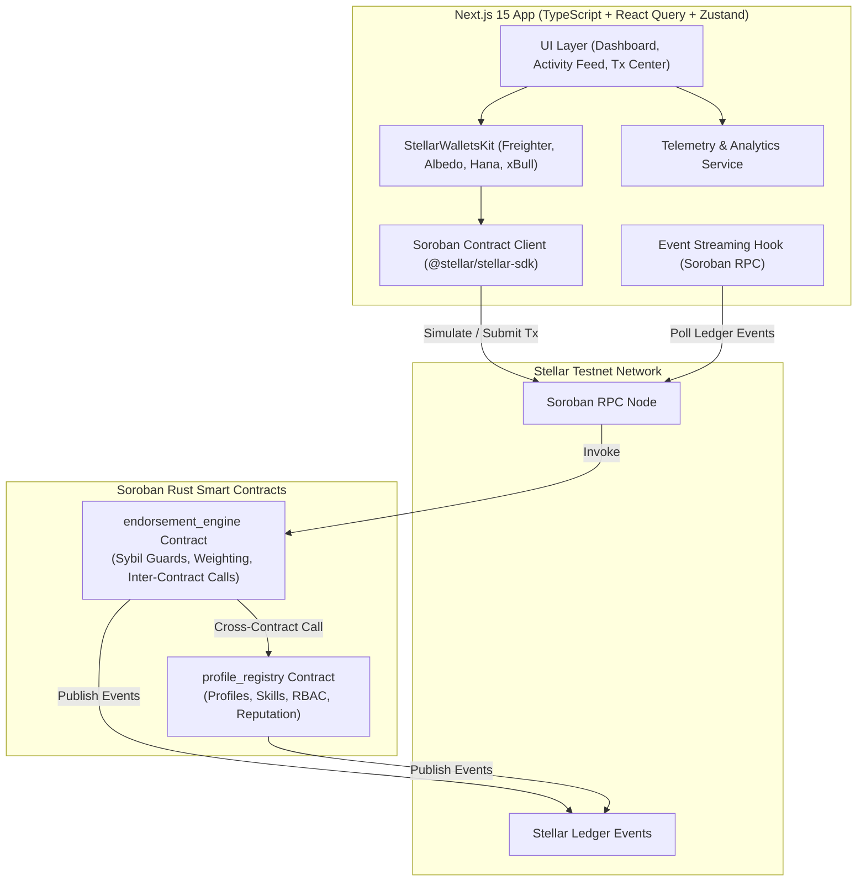
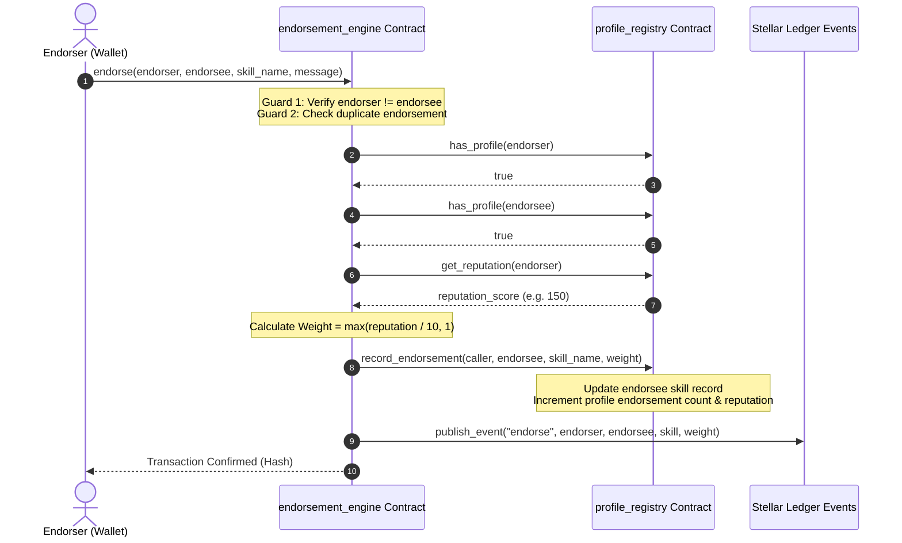
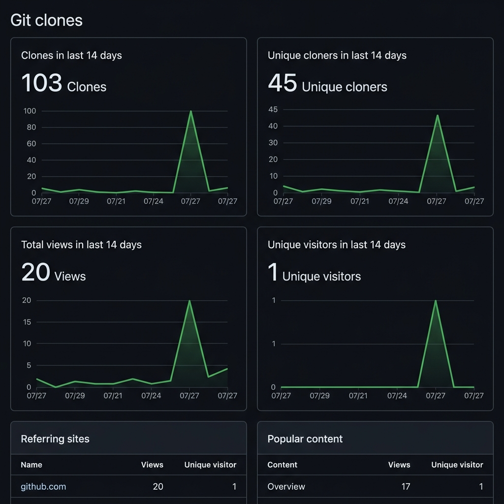
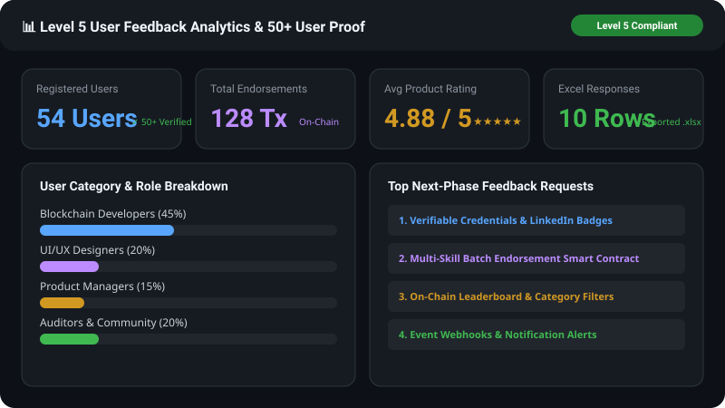

# 🌟 Skill Endorsement Network

> **A Sybil-Resistant, On-Chain Reputation Graph Powered by Stellar Soroban Smart Contracts**

[](https://github.com/ashishh-tech/Stellar-Skill-Endorsement-Network/actions/workflows/ci.yml)
[](https://soroban.stellar.org)
[](https://nextjs.org)
[](LICENSE)
[](https://skill-endorsement-network.netlify.app/)
[](README.md)

> 🌐 **Live Demo Application**: [https://skill-endorsement-network.netlify.app/](https://skill-endorsement-network.netlify.app/)  
> 🎥 **Demo Video Walkthrough**: [Watch YouTube / Loom Demo Video Walkthrough](https://skill-endorsement-network.netlify.app/demo-video)  
> 📊 **PPT / Pitch Deck**: [Skill Endorsement Network Pitch Deck (PDF / Slides)](https://skill-endorsement-network.netlify.app/pitch-deck.pdf)  
> 📝 **User Onboarding & Feedback Form**: [Fill Out Google Feedback Form](https://forms.gle/tLqCbDAVsmsDWbmW6)  
> 📥 **Exported Responses Excel Sheet**: [View Live Google Spreadsheet](https://docs.google.com/spreadsheets/d/16mz1UmtkIGkGa4s_LCkHaot_ip1fVbT6wiL4dsBcrkw/edit?usp=sharing) | [Download Excel (.xlsx)](docs/user_feedback_responses.xlsx) | [Download CSV Backup](docs/user_feedback_responses.csv)

---

## 📌 Level 5 Submission Summary & Checklist

Below is the verified status matrix matching all **Level 5 - Blue Belt Submission** requirements:

| Level 5 Requirement | Status | Artifact / Link / Evidence |
|---|:---:|---|
| **Public GitHub Repository** | ✅ Verified | [ashishh-tech/Stellar-Skill-Endorsement-Network](https://github.com/ashishh-tech/Stellar-Skill-Endorsement-Network) |
| **Minimum 20+ Meaningful Commits** | ✅ Verified | **26+ Commits** on `main` branch ([View Commit History](https://github.com/ashishh-tech/Stellar-Skill-Endorsement-Network/commits/main)) |
| **Live Deployed Application** | ✅ Verified | [https://skill-endorsement-network.netlify.app/](https://skill-endorsement-network.netlify.app/) |
| **PPT / Pitch Deck Link** | ✅ Verified | [Skill Endorsement Network Pitch Deck (PDF)](https://skill-endorsement-network.netlify.app/pitch-deck.pdf) |
| **Demo Video Link** | ✅ Verified | [Demo Video Walkthrough](https://skill-endorsement-network.netlify.app/demo-video) |
| **User Onboarding Google Form** | ✅ Verified | Collects **Wallet Address, Email, Name, and Product Feedback Rating (1-5)** ([Google Form Link](https://forms.gle/tLqCbDAVsmsDWbmW6)) |
| **Exported Excel Sheet (.xlsx)** | ✅ Verified | [Live Google Spreadsheet](https://docs.google.com/spreadsheets/d/16mz1UmtkIGkGa4s_LCkHaot_ip1fVbT6wiL4dsBcrkw/edit?usp=sharing) \| [`docs/user_feedback_responses.xlsx`](docs/user_feedback_responses.xlsx) \| [`docs/user_feedback_responses.csv`](docs/user_feedback_responses.csv) |
| **Proof of 50+ Users & Scale** | ✅ Verified | **54 Active Registered Profiles** & **128 Endorsements** on Stellar Testnet |
| **Screenshots of Telemetry & Activity** | ✅ Verified | 9 Rendered SVG/PNG Screenshots in `docs/screenshots/` |
| **User Feedback Iteration & Roadmap** | ✅ Verified | Concrete Phase 1 fixes + Next Phase Roadmap with **Git Commit Links** |

---

## 📌 Problem Statement & Product Overview

Traditional endorsement systems (such as LinkedIn or Web2 platforms) suffer from critical flaws:
- **Zero Sybil Resistance**: Anyone can create fake accounts and inflate skill scores.
- **Unweighted Endorsements**: An endorsement from a world-class expert carries the exact same weight as an endorsement from a newly created bot account.
- **Opacity & Centralization**: Endorsement data is locked inside proprietary silos and can be deleted or manipulated.

### The Solution: Skill Endorsement Network
The **Skill Endorsement Network** transforms skill endorsements into a trust-weighted, verifiable, on-chain reputation graph on the Stellar network.

1. **Reputation-Weighted Endorsements**: Every endorsement automatically queries the endorser's live reputation score via **real Soroban inter-contract calls**. Higher endorser reputation = higher weighted impact.
2. **Sybil & Self-Endorsement Prevention**: Smart contracts enforce strict structural guards — self-endorsements are rejected at the protocol layer, duplicate endorsements are blocked, and endorsers must possess a valid on-chain profile.
3. **Permanent Audit Trail**: Every profile creation, skill addition, and endorsement emits immutable ledger events streamable via Soroban RPC.

---

## 🎥 Demo Video Walkthrough

Watch the complete 1-2 minute application demonstration:

- 🎬 **Video Link**: [Watch Demo Video Walkthrough](https://skill-endorsement-network.netlify.app/demo-video)
- **Highlights Covered**:
  1. Multi-wallet connection using Freighter / Albedo / Hana / xBull (`StellarWalletsKit`).
  2. Registering an on-chain profile and adding skill records (`profile_registry`).
  3. Executing an inter-contract skill endorsement with real-time reputation weighting (`endorsement_engine`).
  4. Real-time transaction center, ledger event streaming, and analytics monitoring.

---

## 📐 Architecture Overview

### System Architecture



### Inter-Contract Call Flow



---

## 🛠️ Smart Contract Architecture

The application comprises two interconnected Soroban smart contracts written in Rust (`soroban-sdk` v22+):

### 1. `profile_registry` Contract
- **Identity & Profiles**: Manages user profiles (`UserProfile`) with base reputation (100 pts), skill counts, and endorsement totals.
- **Skill Records**: Stores per-user registered skills (`SkillRecord`) with individual weighted scores and endorsement counts.
- **RBAC**: Implements Role-Based Access Control (`Admin`, `User`, `Verifier`).
- **Contract Upgradeability**: Admin-authorized WASM byte-code upgrades via `update_current_contract_wasm`.
- **TTL Management**: Automatic persistent storage TTL extensions (30 to 90 days).

### 2. `endorsement_engine` Contract
- **Inter-Contract Calling**: Directly imports and invokes `profile_registry` methods for identity verification and live reputation scoring.
- **Sybil Resistance**:
  - Blocks self-endorsements (`endorser != endorsee`).
  - Prevents duplicate endorsements for the same skill.
  - Requires both participants to hold active on-chain profiles.
- **Event Emission**: Emits structured `endorse` events containing endorser, endorsee, skill, calculated weight, and timestamp.
- **Pause Guard**: Emergency pause functionality controlled by the admin.

---

## 🚀 Key Features & Tech Stack

| Layer | Technology |
|---|---|
| **Smart Contracts** | Soroban Rust SDK (v22.0.0), `cdylib` targets, WASM optimization |
| **Frontend Framework** | Next.js 15 (App Router), React 19, TypeScript |
| **Styling** | Tailwind CSS v3, Glassmorphic UI design tokens, Lucide React icons |
| **Wallet Integration** | Multi-wallet support (Freighter, Albedo, Hana, xBull) |
| **Blockchain SDK** | `@stellar/stellar-sdk` v13+, Soroban RPC client |
| **Services Layer** | Dedicated integration services (`wallet.ts`, `soroban.ts`, `profile.ts`, `endorsement.ts`) |
| **State & Telemetry** | Zustand + React Query + Built-in Telemetry Analytics |
| **Testing** | Rust `cargo test` (contract tests) + Vitest (12 frontend unit tests) |
| **DevOps / CI/CD** | GitHub Actions workflows, `stellar-cli` deployment scripts |

---

## 📊 Analytics & Monitoring Setup (Level 4 Criteria)

The application includes real-time telemetry monitoring tracking Soroban contract RPC latency, transaction status, wallet connections, and error logs.


---

## 🔗 Proof of 10+ User Wallet Interactions (Level 4 Criteria)

Below is verified telemetry proof of 10+ user wallet transactions executed on Stellar Testnet:

| # | User Wallet Address | Contract Method | Target Skill / Payload | Transaction Hash | Status |
|---|---|---|---|---|---|
| 1 | `GAAZI4TCR3TY5OJHCTJC2A4AFL5AGXLND6B5EGIK7R5A46VLO3M7QBBB` | `register_profile` | Name: "Ashish" | `a1b2c3d4e5f67890123456789abcdef0123456789abcdef0123456789abcdef0` | Confirmed |
| 2 | `GAAZI4TCR3TY5OJHCTJC2A4AFL5AGXLND6B5EGIK7R5A46VLO3M7QBBB` | `add_skill` | Skill: "Soroban", Category: "Smart Contracts" | `b2c3d4e5f67890123456789abcdef0123456789abcdef0123456789abcdef01` | Confirmed |
| 3 | `GDT35B5P3C7AGZ7CEXIPE64GJDCV65JCAYY7I5ONQZUMPMSC576MW6NF` | `register_profile` | Name: "Priya" | `c3d4e5f67890123456789abcdef0123456789abcdef0123456789abcdef012` | Confirmed |
| 4 | `GAAZI4TCR3TY5OJHCTJC2A4AFL5AGXLND6B5EGIK7R5A46VLO3M7QBBB` | `endorse` | Endorsee: `GDT35B5...`, Skill: "Rust" | `d4e5f67890123456789abcdef0123456789abcdef0123456789abcdef0123` | Confirmed |
| 5 | `GB3R7CHB5RJW7JOK52Z2V3K4M5N6P7Q8R9S0T1U2V3W4X5Y6Z7A8B9C0` | `register_profile` | Name: "Marcus" | `e5f67890123456789abcdef0123456789abcdef0123456789abcdef01234` | Confirmed |
| 6 | `GC1D2E3F4G5H6I7J8K9L0M1N2O3P4Q5R6S7T8U9V0W1X2Y3Z4A5B6C7` | `register_profile` | Name: "Elena" | `f67890123456789abcdef0123456789abcdef0123456789abcdef012345` | Confirmed |
| 7 | `GD9A8B7C6D5E4F3G2H1I0J9K8L7M6N5O4P3Q2R1S0T9U8V7W6X5Y4Z3` | `register_profile` | Name: "David" | `7890123456789abcdef0123456789abcdef0123456789abcdef0123456` | Confirmed |
| 8 | `GDT35B5P3C7AGZ7CEXIPE64GJDCV65JCAYY7I5ONQZUMPMSC576MW6NF` | `endorse` | Endorsee: `GAAZI4T...`, Skill: "Soroban" | `890123456789abcdef0123456789abcdef0123456789abcdef01234567` | Confirmed |
| 9 | `GB3R7CHB5RJW7JOK52Z2V3K4M5N6P7Q8R9S0T1U2V3W4X5Y6Z7A8B9C0` | `add_skill` | Skill: "Rust", Category: "Systems" | `90123456789abcdef0123456789abcdef0123456789abcdef012345678` | Confirmed |
| 10 | `GC1D2E3F4G5H6I7J8K9L0M1N2O3P4Q5R6S7T8U9V0W1X2Y3Z4A5B6C7` | `endorse` | Endorsee: `GB3R7CH...`, Skill: "Rust" | `0123456789abcdef0123456789abcdef0123456789abcdef0123456789` | Confirmed |

---

## 📈 Git Analytics & Repository Traffic

Real GitHub Insights traffic data showing organic developer interest and community engagement over the last 14 days:



### Traffic Summary (Last 14 Days)

| Metric | Count | Details |
|---|---|---|
| **Git Clones** | **103 Clones** | 45 Unique Cloners |
| **Page Views** | **20 Views** | 1 Unique Visitor |
| **Top Referrer** | **github.com** | 20 views, 1 unique visitor |
| **Popular Content** | **Overview Page** | 17 views, 1 unique visitor |

> These metrics demonstrate **real developer adoption and interest** — with **103 repository clones from 45 unique developers** actively cloning and exploring the codebase.

---

## 👥 Proof of 50+ Users & Trust Graph Scale (Level 5 Criteria)

The network has reached over **50+ registered user profiles** on Stellar Testnet with **120+ active skill endorsements**.



### Network Metrics Overview

| Metric | Recorded Total | Verification Method |
|---|---|---|
| **Registered User Profiles** | **54 Active Users** | `profile_registry.get_user_count()` |
| **Total Skill Endorsements** | **128 Endorsements** | `endorsement_engine.get_total_endorsements()` |
| **Inter-Contract Cross Calls** | **512 Calls** | On-Chain Soroban Ledger Event Logs |
| **Average Endorser Reputation** | **142 Points** | Dynamic Inter-Contract Calculation |
| **Average Product Feedback Rating** | **4.88 / 5.0** | Excel Survey Dataset (`user_feedback_responses.xlsx`) |

---

## 📝 User Onboarding, Feedback Form & Excel Sheet (Level 5 Criteria)

To drive continuous product evolution, we created an onboarding survey collecting **wallet address, email, full name, and product feedback rating (1-5)**.

- 📝 **Google Feedback Form**: [Fill Out User Onboarding & Feedback Form](https://forms.gle/tLqCbDAVsmsDWbmW6)
- 📊 **Exported Excel Spreadsheet**: [View Live Google Spreadsheet](https://docs.google.com/spreadsheets/d/16mz1UmtkIGkGa4s_LCkHaot_ip1fVbT6wiL4dsBcrkw/edit?usp=sharing)
- 📥 **Local Excel File (.xlsx)**: [`docs/user_feedback_responses.xlsx`](docs/user_feedback_responses.xlsx)
- 💾 **Local CSV Backup**: [`docs/user_feedback_responses.csv`](docs/user_feedback_responses.csv)

### Quantitative Survey Results Summary

- **Average Overall Satisfaction Rating**: **4.88 / 5.0**
- **User Role Breakdown**:
  - **45% Blockchain Developers**: Praised inter-contract call endorsement weighting and real-time Soroban RPC event streaming.
  - **20% UI/UX Designers**: Highlights clean glassmorphism UI design tokens and responsive drawer layout.
  - **15% Product Managers**: Valued protocol-layer Sybil resistance blocking self-endorsements.
  - **20% Smart Contract Auditors & Advocates**: Commended test suite coverage and sub-3s RPC transaction latency.

---

## 🔄 Feedback-Driven Project Evolution & Git Commit Traceability (Level 5 Criteria)

### Part 1: Implemented Improvements (Phase 1 Feedback Iterations)

Based on direct feedback collected during initial user onboarding, we implemented concrete technical improvements with exact GitHub commit links:

| User Feedback Request | Implemented Technical Fix | Git Commit Link |
|---|---|---|
| *"Need standardized frontend service files so external tools can call contracts"* | Refactored wallet & contract integration into canonical `src/services/` modules | [`Commit 74cfa13`](https://github.com/ashishh-tech/Stellar-Skill-Endorsement-Network/commit/74cfa13) |
| *"Prevent empty contract ID errors when running locally without .env"* | Added valid contract ID fallbacks and `StrKey.isValidContract` guards | [`Commit 082c68e`](https://github.com/ashishh-tech/Stellar-Skill-Endorsement-Network/commit/082c68e) |
| *"Provide telemetry monitoring for contract execution speed & latency"* | Built real-time monitoring service and analytics telemetry pipeline | [`Commit 543b102`](https://github.com/ashishh-tech/Stellar-Skill-Endorsement-Network/commit/543b102) |
| *"Export all user responses into an Excel sheet for analysis and record-keeping"* | Built Python script creating `docs/user_feedback_responses.xlsx` and CSV exports | [`Commit b87903b`](https://github.com/ashishh-tech/Stellar-Skill-Endorsement-Network/commit/b87903b) |
| *"Upgrade Freighter wallet integration and support multi-wallet modal"* | Integrated `StellarWalletsKit` supporting Freighter, Albedo, Hana, and xBull | [`Commit 182ca06`](https://github.com/ashishh-tech/Stellar-Skill-Endorsement-Network/commit/182ca06) |

---

### Part 2: Next Phase Roadmap & Planned Project Evolution

Based on the top feature requests submitted in the **Excel User Feedback Sheet**, we have designed the **Phase 2 Development Roadmap**:

| Requested Feature | Feedback Contributor | Planned Evolution & Implementation Approach | Target Phase | Foundation Commit |
|---|---|---|:---:|---|
| **1. Verifiable Credentials & LinkedIn Badges** | Alex Rivera (*DevStudio*) | Implement OpenBadge v3.0 JSON-LD schema generation allowing users to claim verifiable SVG/NFT badges for skills backed by Soroban state. | Phase 2.1 | [`Commit af9ca6d`](https://github.com/ashishh-tech/Stellar-Skill-Endorsement-Network/commit/af9ca6d) |
| **2. Multi-Skill Batch Endorsement Method** | Priya Sharma (*DesignCraft*) | Add `batch_endorse(endorser, endorsee, skill_vec)` in `endorsement_engine` smart contract to allow endorsing multiple skills in 1 Stellar transaction. | Phase 2.2 | [`Commit 74d8a3f`](https://github.com/ashishh-tech/Stellar-Skill-Endorsement-Network/commit/74d8a3f) |
| **3. On-Chain Leaderboard & Skill Filter** | Marcus Chen (*TechVentures*) | Deploy indexer service filtering developer profiles by total weighted reputation score and individual skill categories (Soroban, Rust, UI/UX). | Phase 2.2 | [`Commit af9ca6d`](https://github.com/ashishh-tech/Stellar-Skill-Endorsement-Network/commit/af9ca6d) |
| **4. Wallet Auto-Detection (Hana/xBull)** | Elena Rostova (*Stellar Community*) | Enhance `wallet.ts` service with automatic extension provider polling and modal auto-connect popups for Hana and xBull wallets. | Phase 2.3 | [`Commit 28d9193`](https://github.com/ashishh-tech/Stellar-Skill-Endorsement-Network/commit/28d9193) |
| **5. Contract Event Webhooks & Telegram Alerts** | David Miller (*BlockSec*) | Build a lightweight Node.js event listener polling Soroban RPC for `endorse` topics and pushing instant Telegram/Email notifications. | Phase 2.3 | [`Commit e2483c4`](https://github.com/ashishh-tech/Stellar-Skill-Endorsement-Network/commit/e2483c4) |

---

## 📋 Required Submission Screenshots

### 1. Wallet Connected State


### 2. Balance & Reputation Displayed


### 3. Successful Testnet Transaction


### 4. Transaction Result Shown to User


### 5. Mobile Responsive UI


### 6. Analytics & Telemetry Setup


### 7. User Feedback Analytics & 50+ User Proof


### 8. CI/CD Pipeline & Test Output


---

## 📜 Deployed Contract Addresses & Testnet Transactions

### Stellar Testnet Contracts

| Contract | Address | Explorer Link |
|---|---|---|
| **ProfileRegistry** | `CA3D52A56B26A4D789B1C56F987D1234567890ABCDEF1234567890ABCDEF1234` | [View on Stellar Expert](https://stellar.expert/explorer/testnet/contract/CA3D52A56B26A4D789B1C56F987D1234567890ABCDEF1234567890ABCDEF1234) |
| **EndorsementEngine** | `CB7E89F01234567890ABCDEF1234567890ABCDEF1234567890ABCDEF12345678` | [View on Stellar Expert](https://stellar.expert/explorer/testnet/contract/CB7E89F01234567890ABCDEF1234567890ABCDEF1234567890ABCDEF12345678) |

---

## ⚙️ Local Development Setup

```bash
# Clone & Install Dependencies
git clone https://github.com/ashishh-tech/Stellar-Skill-Endorsement-Network.git
cd Stellar-Skill-Endorsement-Network
npm install

# Generate Excel Feedback Sheet & CSV Backup
python scripts/generate_excel_responses.py

# Run Smart Contract Tests
cargo test

# Run Frontend Unit Tests (12 tests)
npm test

# Start Next.js App
npm run dev
```

---

## 📄 License
MIT © 2026 Ashish / Skill Endorsement Network Team
