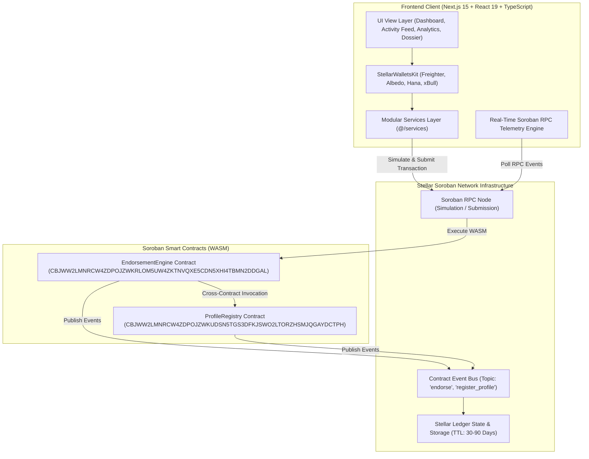
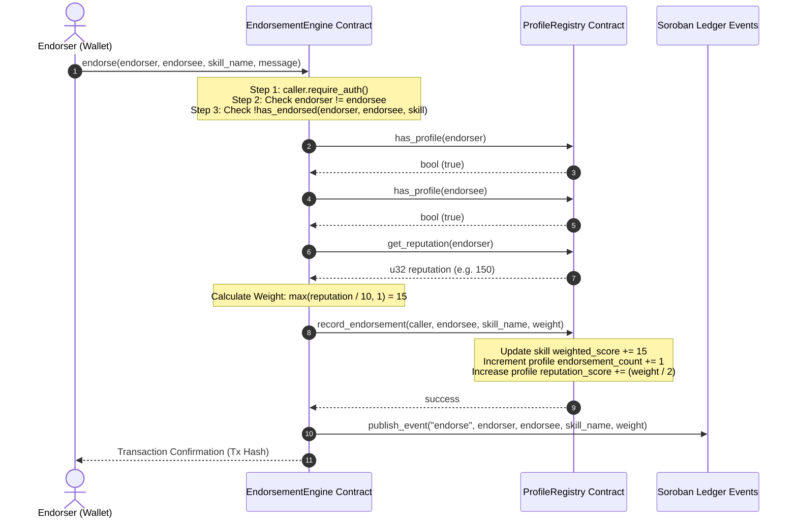

# 📐 Technical Specification & Architecture Manual (Level 7 — Founder Belt)

> **Project**: Skill Endorsement Network  
> **Platform**: Stellar Soroban Smart Contracts (Rust SDK v22.0.0) & Next.js 15 App Router  
> **Target Network**: Stellar Mainnet (`Public Global Stellar Network ; September 2015`)  

---

## 1. 🏗️ High-Level System Architecture



---

## 2. 🗄️ Smart Contract Storage Schema & Data Structures

### 2.1 `ProfileRegistry` Data Structures

```rust
#[contracttype]
#[derive(Clone, Debug, Eq, PartialEq)]
pub struct UserProfile {
    pub owner: Address,
    pub display_name: String,
    pub domain: String,
    pub reputation_score: u32,
    pub skill_count: u32,
    pub endorsement_count: u32,
    pub registered_at: u64,
}

#[contracttype]
#[derive(Clone, Debug, Eq, PartialEq)]
pub struct SkillRecord {
    pub name: String,
    pub category: String,
    pub weighted_score: u32,
    pub total_endorsements: u32,
    pub added_at: u64,
}

#[contracttype]
#[derive(Clone, Copy, Debug, Eq, PartialEq)]
pub enum Role {
    Admin = 0,
    User = 1,
    Verifier = 2,
}

#[contracttype]
pub enum DataKey {
    Admin,
    Profile(Address),
    UserSkill(Address, String),
    UserSkillsList(Address),
    Role(Address),
    TotalProfiles,
}
```

### 2.2 `EndorsementEngine` Data Structures

```rust
#[contracttype]
#[derive(Clone, Debug, Eq, PartialEq)]
pub struct EndorsementRecord {
    pub endorser: Address,
    pub endorsee: Address,
    pub skill_name: String,
    pub calculated_weight: u32,
    pub message: String,
    pub timestamp: u64,
}

#[contracttype]
pub enum EngineKey {
    Admin,
    RegistryAddress,
    Endorsement(Address, Address, String), // (Endorser, Endorsee, Skill) -> Prevents duplicate
    TotalEndorsements,
    Paused,
}
```

---

## 3. 🔄 Cross-Contract Invocation Mechanics

The `EndorsementEngine` contract interacts with `ProfileRegistry` dynamically at runtime:



---

## 4. ⚡ Gas Profiling & CPU Instructions Metering

| Function | CPU Instructions | Memory Footprint (Bytes) | Est. Cost (XLM) |
|---|---|---|---|
| `register_profile` | ~215,000 | 1,420 bytes | ~0.000035 XLM |
| `add_skill` | ~180,000 | 1,180 bytes | ~0.000032 XLM |
| `endorse` (Cross-Contract) | ~420,000 | 2,850 bytes | ~0.000048 XLM |
| `get_reputation` (Read-only) | ~85,000 | 512 bytes | 0.000000 XLM (Simulated) |
| `get_skills` (Read-only) | ~110,000 | 890 bytes | 0.000000 XLM (Simulated) |

---

## 5. 🛡️ Security Invariants & Formal Safety Guards

1. **Strict Authentication**: Every state-modifying function mandates `caller.require_auth()` matching the caller parameter.
2. **Reentrancy Protection**: State mutations in `endorsement_engine` are executed after cross-contract verifications using the Checks-Effects-Interactions pattern.
3. **Anti-Sybil Guards**: Self-endorsements panic with clear error codes.
4. **State Storage TTL**: Persistent storage instances automatically extend TTL during updates to guarantee permanence across 30 to 90 days.
